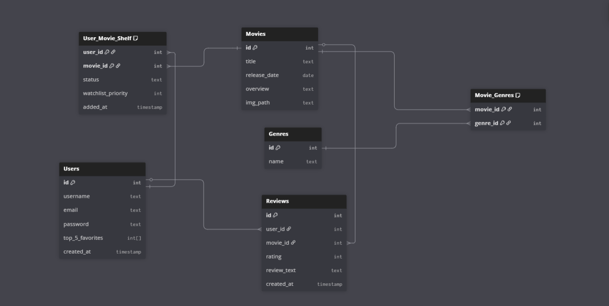

# Entity Relationship Diagram

Reference the Creating an Entity Relationship Diagram final project guide in the course portal for more information about how to complete this deliverable.

## Create the List of Tables

- Users
- Movies
- Genre
- Movie_Genres
- User_Movie_Shelf
- Reviews

## Add the Entity Relationship Diagram

---

## Table Schemas

### Users

| Column Name     | Type      | Description                                                  |
| --------------- | --------- | ------------------------------------------------------------ |
| id              | serial primary key   | Primary key, unique identifier for each user                 |
| username        | text not null unique    | User's unique username for login and display                 |
| email           | text  not null unique    | User's email address for authentication                      |
| password        | text not null     | Hashed password for secure authentication                    |
| top_5_favorites | integer[] | Array of movie IDs representing user's top 5 favorite movies |
| created_at      | timestamp | Timestamp when the user account was created                  |

### Movies

| Column Name  | Type    | Description                                   |
| ------------ | ------- | --------------------------------------------- |
| id           | integer primary key | Primary key, unique identifier for each movie |
| title        | text not null  | The title of the movie                        |
| release_date | date    | The date the movie was released               |
| overview     | text    | A brief description or synopsis of the movie  |
| img_path     | text    | URL or file path to the movie's poster image  |

### Genres

| Column Name | Type    | Description                                                |
| ----------- | ------- | ---------------------------------------------------------- |
| id          | integer primary key | Primary key, unique identifier for each genre              |
| name        | text not null unique   | The name of the genre (e.g., "Horror", "Comedy", "Sci-Fi") |

### Movie_Genres

| Column Name | Type    | Description                       |
| ----------- | ------- | --------------------------------- |
| movie_id    | integer | Foreign key referencing Movies.id |
| genre_id    | integer | Foreign key referencing Genres.id |

**Composite Primary Key:** (movie_id, genre_id)

**Relationships:**

- Many-to-Many relationship between Movies and Genres
- A movie can have multiple genres
- A genre can be associated with multiple movies

### User_Movie_Shelf

| Column Name        | Type      | Description                                                                         |
| ------------------ | --------- | ----------------------------------------------------------------------------------- |
| user_id            | integer   | Foreign key referencing Users.id                                                    |
| movie_id           | integer   | Foreign key referencing Movies.id                                                   |
| status             | text      | The shelf status: 'completed', 'want_to_watch', or 'now_watching'                   |
| watchlist_priority | integer   | Priority order for movies in the 'want_to_watch' shelf (for drag-and-drop ordering) |
| added_at           | timestamp | Timestamp when the movie was added to this shelf                                    |

**Composite Primary Key:** (user_id, movie_id)

**Relationships:**

- Links users to movies they're tracking
- Represents the user's personal shelves/lists

### Reviews

| Column Name | Type      | Description                                                      |
| ----------- | --------- | ---------------------------------------------------------------- |
| id          | serial primary key   | Primary key, unique identifier for each review                   |
| user_id     | integer   | Foreign key referencing Users.id (the user who wrote the review) |
| movie_id    | integer   | Foreign key referencing Movies.id (the movie being reviewed)     |
| rating      | integer   | User's star rating for the movie (1-5 stars)                     |
| review_text | text      | The written review content                                       |
| created_at  | timestamp | Timestamp when the review was created                            |

**Relationships:**

- A user can write multiple reviews (one per movie)
- A movie can have multiple reviews from different users
- Includes both the star rating and written review content
